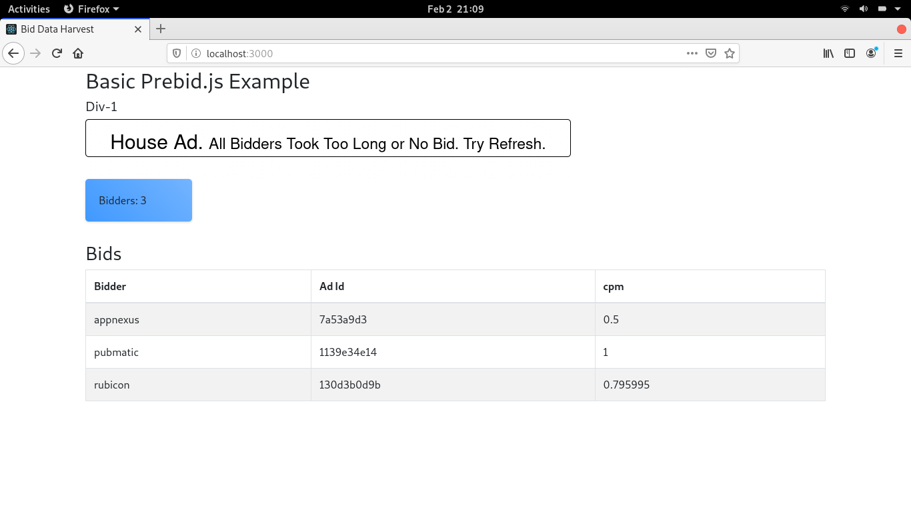

# pubX-Interview
A submission to the PubX Interview question

## Part 1
Submission: System architecture diagram and justification document

## Part 2
Working code for task a)

### Run the app
- Navigate into the `pubx/` folder by running `cd pubx/`

- Install React bootstrap by running `npm install react-bootstrap bootstrap`

- Install dependencies by running `npm install`

- Start the application by running `npm start`

Should the app throw an error, consider refreshing the app.
## Screenshots
Using Mock data

